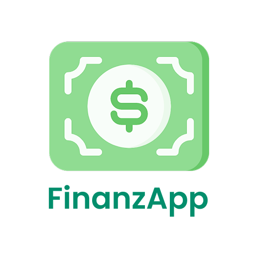

<div align="center">
  
  <h1>💸 FinanzApp Co</h1>
  <p>Educación financiera para jóvenes colombianos, con aprendizaje gamificado.</p>
</div>

---

> ⚠️ **Nota:** Este es un proyecto privado en desarrollo. El acceso, uso o distribución está limitado a colaboradores autorizados.

---

## 📌 Tabla de Contenidos

- [🎯 Contexto y Objetivo](#-contexto-y-objetivo)
- [✨ Características Principales](#-características-principales)
- [📁 Estructura del Proyecto](#-estructura-del-proyecto)
- [🛠️ Instalación y Ejecución](#-instalación-y-ejecución)
- [🤝 Contribuciones](#-contribuciones)
- [📜 Licencia](#-licencia)
- [🗺️ Roadmap](#-roadmap)
- [🧭 Guía de Contribución](#-guía-de-contribución)
- [🔗 Recursos](#-recursos)

---

## 🎯 Contexto y Objetivo

La educación financiera es esencial en la vida de los jóvenes, pero pocas herramientas se enfocan en enseñar buenas prácticas de manera accesible y divertida.

**FinanzApp Co** nace para resolver esto mediante:

- 📊 Registro y seguimiento de ingresos y gastos
- 📚 Contenido educativo interactivo y gamificado
- 🧮 Herramientas para presupuestos personalizados (en proceso)
- 🏆 Módulos de ahorro con retos y recompensas (en proceso)

---

## ✨ Características Principales

- 🔁 Código compartido con **Kotlin Multiplatform**
- 🎨 UI moderna con **Jetpack Compose Multiplatform**
- 🔐 Autenticación y Firestore mediante **Firebase**
- 🌗 Soporte para **modo oscuro**
- 🌎 **Multiidioma** (en progreso)
- 📱 Arquitectura pensada para **Android, iOS y escritorio**

---

## 📁 Estructura del Proyecto

- **/composeApp:** Lógica y componentes reutilizables entre plataformas.
    - `commonMain`: Código común.
    - `iosMain`, `androidMain`: Código específico para cada plataforma.

- **/iosApp:** Punto de entrada para la app iOS, integración con KMP.

- **/androidApp:** Punto de entrada para la app Android, configuración y recursos nativos.

## 🛠️ Instalación y Ejecución

1. 🔐 Clona este repositorio:
   ```sh
    git clone https://github.com/Tihamer-k/finanzapp_co.git
    cd finanzapp_co
   ```
2. Abre el proyecto en [Android Studio](https://developer.android.com/studio) o [IntelliJ IDEA](https://www.jetbrains.com/idea/).

3. Sincroniza dependencias con **Gradle**.

4. Ejecuta según la plataforma:
   - ✅ **Android:** selecciona un emulador o dispositivo físico y ejecuta desde Android Studio.
   - 🍏 **iOS:** abre `iosApp` en Xcode y corre en simulador (requiere macOS).

## 🤝 Contribuciones
🙋‍♂️ Actualmente limitado a colaboradores autorizados.

1. Haz un fork privado si tienes permisos.
2. Crea una rama (`git checkout -b feature/nueva-funcionalidad`)
3. Realiza tus cambios siguiendo las buenas prácticas de Kotlin Multiplatform.
4. Envía un pull request detallando el propósito y contexto de la mejora.

## 📜 Licencia
Este es un proyecto privado. No cuenta con licencia de distribución pública.

## 🗺️ Roadmap
Consulta el 📄 [ROADMAP.md](ROADMAP.md) para ver las tareas y prioridades planificadas.

## 🧭 Guía de Contribución
Consulta la guía 📄 [CONTRIBUTING.md](CONTRIBUTING.md) para conocer el proceso de contribución, normas y estilo de código.

## 🔗 Recursos
- Kotlin Multiplatform Docs 
- Jetpack Compose Multiplatform 
- Firebase Docs
- Material Theme Builder
- Google Fonts
- Freepik - Vectores
- SQLDelight
- Superintendencia Financiera de Colombia